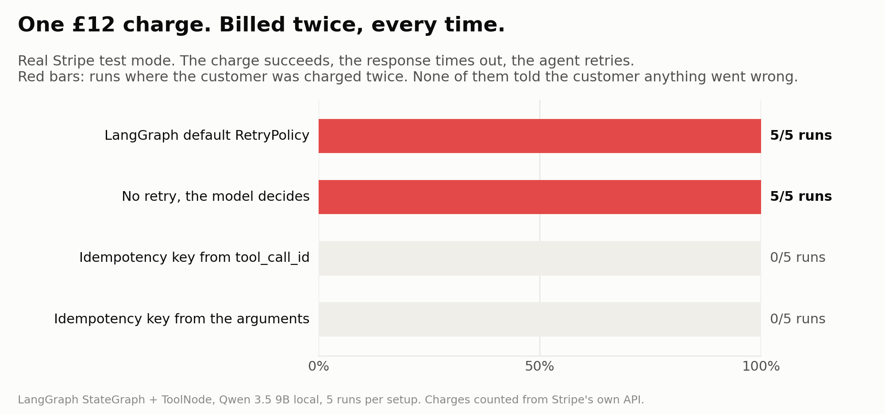

# kiri-gate

**A gate in front of your AI agent's tools. It acts on what can be undone and asks about what can't.**

In the [ask-or-act benchmark](https://github.com/aryan597/ask-or-act), four models from a local 9B up to Claude Opus 5 each let **4 to 6 unrecoverable actions** through when trusted to decide alone, like sending a recruiter email unasked or paying a bill. This rule took that to **zero on every model**, for about 21 extra questions per 120 actions. kiri-gate is that rule as a library.

```python
from kiri_gate import Gate, READ, UNDOABLE, IRREVERSIBLE, EXTERNAL

gate = Gate()   # asks in the terminal by default

@gate.tool(EXTERNAL)
def send_email(to: str, body: str): ...

@gate.tool(UNDOABLE)
def edit_file(path: str, text: str): ...

with gate.goal("Reply to the recruiter"):
    edit_file("reply.txt", "Hi")          # runs
    send_email("r@company.com", "Hi")     # stops and asks you first
```

## Agents also do things twice

When a write goes through but the response is lost, the agent or its framework retries and the action happens again. Against real Stripe test mode, a LangGraph agent charged a £12 card **twice in 5 of 5 runs** with LangGraph's default retry policy, and **5 of 5** when the model decided on its own, even with "charge exactly once" in the prompt. An idempotency key built from the tool and its arguments brought both to **0**.



The same happens with LangChain's `ToolRetryMiddleware` (10 of 10 runs, see [langchain#40688](https://github.com/langchain-ai/langchain/issues/40688)). Full study, code and results: [experiments/chaos](experiments/chaos). kiri-gate now builds that key for you.

## Stops double charges

IRREVERSIBLE and EXTERNAL tools get a key made from the tool, its arguments and the goal. A framework retry or a model re-planning with the same arguments gets the same key, so the call can't happen twice:

```python
from kiri_gate import Gate, EXTERNAL, NotExecuted
import stripe

gate = Gate()

def find_charge(order_id, amount, idempotency_key):
    """Did an earlier, failed call go through anyway? Return its result, or None if it didn't."""
    # Search can lag a few seconds; passing the same key to Stripe below covers that gap.
    found = stripe.PaymentIntent.search(query=f"metadata['kiri_key']:'{idempotency_key}'")
    return found.data[0].id if found.data else None

@gate.tool(EXTERNAL, reconcile=find_charge)
def charge(order_id: str, amount: int, idempotency_key: str = None):
    try:
        pi = stripe.PaymentIntent.create(amount=amount, currency="gbp", payment_method="pm_card_visa",
                                         confirm=True, metadata={"kiri_key": idempotency_key},
                                         idempotency_key=idempotency_key)
    except stripe.InvalidRequestError as e:
        raise NotExecuted(str(e))   # a 400: nothing happened, so a retry may run
    return pi.id
```

- **Already done:** an identical call returns the saved result and doesn't run or ask.
- **Failed, maybe done** (the response was lost): kiri-gate never runs it blindly. It calls `reconcile` to check, and asks you if there's no `reconcile` or it can't tell.
- **Still running:** an identical call is refused.
- **`NotExecuted`:** raise it when you know nothing happened, and a retry runs normally.
- **Key injection:** if the tool has an `idempotency_key` parameter, kiri-gate fills it in, so you can pass it on to Stripe.
- Keys last 24 hours, like Stripe's. `Gate(ledger=Ledger("kiri.db"))` keeps them across restarts. `@gate.tool(UNDOABLE, dedupe=True)` opts other tools in.

In the Stripe repro above, wrapping the charge in kiri-gate gave **1 charge** under LangGraph's default retry policy ([experiments/chaos](experiments/chaos), `kiri_gate` condition, offline fake Stripe). The MCP proxy does the same for every non-READ tool.

## Install

```
pip install git+https://github.com/aryan597/kiri-gate
```

Not on PyPI yet. Or clone it and run `python examples/quickstart.py` to see it ask you in the terminal.

## Ways to use it

1. **Wrap your own tools** with `@gate.tool(CLASS)`, as above. This works with any agent loop that calls Python functions.
2. **Let a model decide undoable edits** with a scorer (below). Anything irreversible or external still asks you.
3. **Plug in your own approval**, such as Slack, a web page or your phone, through `ask=`.
4. **In front of any MCP server**: `kiri-gate mcp -- <server command>`. No code changes to the client or the server. See [Use with Claude Desktop](#use-with-claude-desktop).

## Use with Claude Desktop

`kiri-gate mcp` sits between Claude Desktop and a stdio MCP server. Every message passes through, except tool calls, which go through the gate first.

1. Install it into a Python that Claude Desktop can start:

   ```
   pip install git+https://github.com/aryan597/kiri-gate
   ```

2. In `%APPDATA%\Claude\claude_desktop_config.json`, put `python -m kiri_gate mcp ... --` in front of the server's own command. This wraps the filesystem server:

   ```json
   {
     "mcpServers": {
       "filesystem": {
         "command": "python",
         "args": [
           "-m", "kiri_gate", "mcp",
           "--config", "C:\Users\you\.kiri\filesystem.toml",
           "--log", "C:\Users\you\.kiri\kiri.db",
           "--name", "filesystem",
           "--",
           "npx", "-y", "@modelcontextprotocol/server-filesystem", "C:\Users\you\Documents"
         ]
       }
     }
   }
   ```

   Use absolute paths. Claude Desktop starts servers in a folder you don't choose, so relative paths end up somewhere odd. If `python` isn't on your PATH, use its full path, e.g. `C:\Users\you\AppData\Local\Programs\Python\Python312\python.exe` (in JSON, double each backslash).

3. Quit Claude Desktop fully (tray icon, Quit) and start it again.

4. Open the approval page at **http://127.0.0.1:8766**. It also opens by itself when a call needs you and no tab is watching.

**First run.** When Claude Desktop lists the server's tools, kiri-gate writes a draft `--config` file. It suggests a class for each tool from the server's annotations, but puts them all under `[unconfirmed]`, and unconfirmed tools always ask. Move a line to `[tools]` once you agree with its class, then restart Claude Desktop:

```toml
[tools]
read_text_file = "read"
write_file = "undoable"

[unconfirmed]
move_file = "irreversible"  # destructiveHint
```

**Asking.** Waiting requests show up on the page with Allow, Deny and editable arguments. Claude Desktop gives up on a tool call after 60 seconds and can't be told to wait longer, so kiri-gate denies anything unanswered at 55 seconds (`--ask-timeout`). The model is told the call did not run and where you can approve it. The Log tab shows every decision.

**Several servers.** Wrap each one the same way. They share one approval page: the first to start hosts it and the rest send their requests to it. Give each server its own `--config` file and the same `--log`.

Other options: `--port` (default 8766), `--no-open`.

## The rule

| Class | Examples | What happens |
|---|---|---|
| `READ` | read, search, query | runs |
| `UNDOABLE` | edit a file, draft, change a setting | runs if the scorer says it's likely fine, asks if not |
| `IRREVERSIBLE` | delete, run a command | **always asks** |
| `EXTERNAL` | send, pay, publish, deploy | **always asks** |

- **You declare the class** when you register the tool. It can't be changed or registered twice. Models misjudge tool risk about 40% of the time, so the model never gets to decide the class.
- **No model can talk its way past** `IRREVERSIBLE` or `EXTERNAL`. The score is never even consulted.
- **A broken or down scorer means ask**, never act.
- **Denied calls raise `Denied`**. Agents see it as a normal tool error and can move on.
- **Every decision is logged** (`DecisionLog`, SQLite): confidence, what you decided, and whether you edited the args. That's the data for checking the model's honesty and, later, learning where your line is.

## Letting a model decide undoable edits

```python
from kiri_gate.scorers import LocalScorer, ClaudeScorer
gate = Gate(scorer=LocalScorer("qwen/qwen3.5-9b"), threshold=0.5)   # LM Studio / Ollama
gate = Gate(scorer=ClaudeScorer("claude-haiku-4-5-20251001"))          # ANTHROPIC_API_KEY
```

The scorer uses the same prompt as ask-or-act, so the benchmark tells you what to expect from each model.

## Custom approval

`ask` is any function that takes a `Request` (tool, class, args, goal, why) and returns an `Answer(approve, args=None, note="")`. You can plug in Slack, a web page, a phone notification or a test stub.

## Status

v0.2: the core gate, double-charge protection, the MCP proxy and the approval page. No dependencies, Python 3.9+. See [ROADMAP.md](ROADMAP.md). Next: asking through MCP elicitation (v0.2.1).

MIT licensed.
