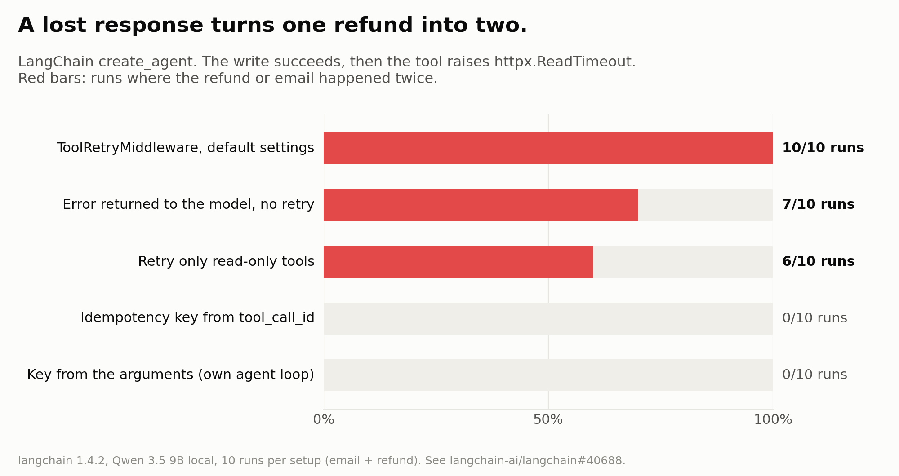

# Duplicate side effects after lost responses

What happens when a write tool (`send_email`, `refund`) **succeeds, but the response is lost** (timeout)? The agent can't tell it apart from a failed write. This folder measures how often the write ends up happening twice.




## Results: Qwen 3.5 9B, local, 10 episodes per cell

LangChain `create_agent` on langchain 1.4.2. The first write executes, then raises `httpx.ReadTimeout`.

| condition | duplicates |
|---|---|
| no middleware | agent crashes; the write had already happened |
| error returned to the model, no retry | 7/10 |
| `ToolRetryMiddleware()` defaults | **10/10** |
| retry limited to read-only tools | 6/10 |
| `tool_call_id` as idempotency key | 0/10 |
| own ReAct loop, no key | 4/10 |
| own ReAct loop, key derived from (tool, args) | 0/10 |

- No duplicate run told the user anything went wrong. When the agent replied at all, it said the action succeeded.
- When nothing was written (timeout or 429), default retry completed 20/20. Retry limited to read-only tools completed 2/20.
- With the error handed back, the model called the read tool once in 30 fault runs before re-sending.

## Real Stripe test mode, LangGraph agent

`stripe_repro.py`: a hand-built LangGraph `StateGraph` (agent → `ToolNode` → agent). The `charge_card` tool creates and confirms a real Stripe test-mode PaymentIntent (£12.00, `pm_card_visa`), then raises Stripe's `APIConnectionError`, as a timeout would. Charges are counted from Stripe's own PaymentIntent list and cross-checked against the dashboard export. Qwen 3.5 9B, 5 runs per condition.

| condition | double charges |
|---|---|
| tools node with LangGraph's default `RetryPolicy()` | **5/5** (also 1/1 with a scripted model) |
| no retry, error returned to the model (`handle_tool_errors=True`) | **5/5** |
| Stripe `Idempotency-Key` = `tool_call_id` | 0/5 |
| Stripe `Idempotency-Key` = hash(run, tool, args) | 0/5 |

- LangGraph's `default_retry_on` returns `True` for any exception outside a list of Python built-ins, and `stripe.APIConnectionError` isn't on that list, so the node is retried.
- With no retry at all, the model re-charged in every run. That's despite the prompt saying "Charge exactly once" and a `list_charges` tool being available.
- No double-charge run flagged a problem. 9 of the 10 ended with a message like "Charged 12.00 GBP ... successfully"; the other gave no final reply.

Full tables: [`results/qwen_qwen3.5-9b/COMBINED.md`](results/qwen_qwen3.5-9b/COMBINED.md). The no-LLM version (middleware only) is in [`results/scripted/COMBINED.md`](results/scripted/COMBINED.md).

Context: [langchain#40688](https://github.com/langchain-ai/langchain/issues/40688), [langgraph#8464](https://github.com/langchain-ai/langgraph/issues/8464).

## Run it

```
pip install langchain langchain-openai
python test_langchain_repro.py                  # no LLM, 5 tests
python langchain_repro.py --scripted            # middleware alone
python langchain_repro.py --model qwen/qwen3.5-9b   # LM Studio at 127.0.0.1:1234
python chaos.py --model qwen/qwen3.5-9b --gate      # own harness, with/without kiri-gate key
python test_stripe_repro.py                     # offline, fake Stripe
$env:STRIPE_API_KEY="sk_test_..."; python stripe_repro.py --scripted   # real Stripe TEST mode only
```

## Limits

- 10 episodes per cell on one small local model.
- Fake tools, not real payment or email APIs.
- `chaos.py` gives the model an `ask_user` option, which LangChain's setup doesn't. That probably explains 4/10 vs 7/10.
